# ExamInA - Diagrama de entidades

Este documento describe una primera propuesta del modelo de datos de ExamInA.

La intención es visualizar cómo se relacionan las tablas principales y dejar claro para qué sirve cada entidad antes de pasar a Prisma o a migraciones reales.

## Diagrama ER

```mermaid
erDiagram
  USER ||--|| USER_PROFILE : has
  USER ||--|| USER_PREFERENCES : has
  USER ||--|| USER_PROGRESS : has
  USER ||--o{ ATTEMPT : creates
  USER ||--o{ EXAM_SESSION : starts
  USER ||--o{ FILE_ASSET : uploads
  USER ||--o{ STUDY_ACTIVITY : records
  USER ||--o{ USER_SUBJECT_PROGRESS : tracks
  USER ||--o{ USER_TOPIC_PROGRESS : tracks
  USER ||--o{ USER_ACHIEVEMENT : unlocks
  USER ||--o{ FRIENDSHIP : requests
  USER ||--o{ FRIENDSHIP : receives
  USER ||--o{ LLM_REVIEW_ASSET : owns
  USER ||--o{ USER_MODERATION_ACTION : receives
  USER ||--o{ USER_MODERATION_ACTION : moderates
  USER ||--o{ COMMUNITY_POST : publishes
  USER ||--o{ COMMUNITY_COMMENT : writes
  USER ||--o{ COMMUNITY_REACTION : reacts
  USER ||--o{ SHARED_EXAM : shares
  USER ||--o{ SHARED_EXAM_USAGE : uses
  USER ||--o{ CONTENT_REPORT : reports
  USER ||--o{ CONTENT_REPORT : reported_in

  USER_PROFILE }o--o| FILE_ASSET : avatar
  USER_PROFILE }o--o| FILE_ASSET : banner

  SUBJECT ||--o{ TOPIC : contains
  SUBJECT ||--o{ QUESTION : contains
  SUBJECT ||--o{ USER_SUBJECT_PROGRESS : measured_by

  TOPIC ||--o{ QUESTION : contains
  TOPIC ||--o{ USER_TOPIC_PROGRESS : measured_by

  QUESTION ||--|| QUESTION_SOLUTION : has
  QUESTION ||--o{ QUESTION_KEYWORD : has
  QUESTION ||--o{ ATTEMPT : answered_in
  QUESTION ||--o{ EXAM_SESSION_QUESTION : appears_in
  QUESTION ||--o{ EXAM_SESSION_ANSWER : answered_in

  QUESTION_SOLUTION ||--o{ EXAM_SESSION_QUESTION : snapshotted_in

  ATTEMPT ||--|| CORRECTION : has
  ATTEMPT ||--o{ ATTEMPT_ASSET : includes
  ATTEMPT ||--o{ EXAM_SESSION_ANSWER : linked_to
  ATTEMPT ||--o{ LLM_REVIEW_ASSET : reviewed_by

  EXAM_SESSION ||--o{ EXAM_SESSION_QUESTION : contains
  EXAM_SESSION ||--o{ EXAM_SESSION_ANSWER : stores
  EXAM_SESSION ||--o{ EXAM_SESSION_ASSET : includes
  EXAM_SESSION ||--o{ LLM_REVIEW_ASSET : reviewed_by
  EXAM_SESSION ||--o{ COMMUNITY_POST : shared_in
  EXAM_SESSION ||--o{ SHARED_EXAM : source_for

  FILE_ASSET ||--o{ ATTEMPT_ASSET : attached_to
  FILE_ASSET ||--o{ EXAM_SESSION_ASSET : attached_to
  FILE_ASSET ||--o{ LLM_REVIEW_ASSET : processed_by

  ACHIEVEMENT ||--o{ USER_ACHIEVEMENT : unlocked_by

  COMMUNITY_POST ||--o{ COMMUNITY_COMMENT : has
  COMMUNITY_POST ||--o{ COMMUNITY_REACTION : receives
  COMMUNITY_POST ||--o{ CONTENT_REPORT : reported_by
  SHARED_EXAM ||--o{ COMMUNITY_POST : referenced_by
  COMMUNITY_COMMENT ||--o{ COMMUNITY_REACTION : receives
  COMMUNITY_COMMENT ||--o{ COMMUNITY_COMMENT : replies
  COMMUNITY_COMMENT ||--o{ CONTENT_REPORT : reported_by
  SHARED_EXAM ||--o{ SHARED_EXAM_QUESTION : contains
  SHARED_EXAM ||--o{ SHARED_EXAM_USAGE : used_by
  SHARED_EXAM ||--o{ CONTENT_REPORT : reported_by
  QUESTION ||--o{ SHARED_EXAM_QUESTION : included_in
  EXAM_SESSION ||--o{ SHARED_EXAM_USAGE : generated_from

  USER {
    string id PK
    string firebaseUid UK
    string email
    string displayName
    string photoUrl
    string role
    string status
    datetime createdAt
    datetime updatedAt
  }

  USER_PROFILE {
    string id PK
    string userId FK
    string username UK
    string bio
    string avatarFileId FK
    string bannerFileId FK
    int level
    int experience
    int currentStreakDays
    int longestStreakDays
    datetime lastStudyDate
    datetime createdAt
    datetime updatedAt
  }

  USER_PREFERENCES {
    string id PK
    string userId FK
    string preferredTheme
    string preferredLanguage
    boolean notificationsEnabled
    boolean studyReminderEnabled
    string studyReminderTime
    boolean timerSoundEnabled
    boolean defaultTimerEnabled
    int defaultExamDurationSeconds
    json preferredSubjects
    datetime createdAt
    datetime updatedAt
  }

  SUBJECT {
    string id PK
    string name
    string slug UK
    string description
    datetime createdAt
  }

  TOPIC {
    string id PK
    string subjectId FK
    string name
    string slug
    datetime createdAt
  }

  QUESTION {
    string id PK
    string subjectId FK
    string topicId FK
    string statement
    string type
    string difficulty
    int sourceYear
    string sourceExam
    datetime createdAt
    datetime updatedAt
  }

  QUESTION_SOLUTION {
    string id PK
    string questionId FK
    string finalAnswer
    string explanation
    json gradingCriteria
    datetime createdAt
    datetime updatedAt
  }

  QUESTION_KEYWORD {
    string id PK
    string questionId FK
    string keyword
  }

  ATTEMPT {
    string id PK
    string userId FK
    string questionId FK
    string examSessionId FK
    string userAnswer
    float score
    string status
    datetime createdAt
    datetime updatedAt
  }

  CORRECTION {
    string id PK
    string attemptId FK
    boolean isCorrect
    float score
    string summary
    string feedback
    json detectedErrors
    json missingKeywords
    json suggestions
    json recommendedTopics
    datetime createdAt
  }

  EXAM_SESSION {
    string id PK
    string userId FK
    string title
    string mode
    string status
    boolean timerEnabled
    int durationLimitSeconds
    datetime startedAt
    datetime finishedAt
    datetime lastActivityAt
    datetime resumeExpiresAt
    int totalTimeSeconds
    float totalScore
    float maxScore
    datetime createdAt
    datetime updatedAt
  }

  EXAM_SESSION_QUESTION {
    string id PK
    string examSessionId FK
    string questionId FK
    int order
    json questionSnapshot
    json solutionSnapshot
    datetime createdAt
  }

  EXAM_SESSION_ANSWER {
    string id PK
    string examSessionId FK
    string questionId FK
    string attemptId FK
    string userAnswer
    float score
    boolean isCorrect
    datetime answeredAt
    datetime createdAt
  }

  FILE_ASSET {
    string id PK
    string userId FK
    string bucket
    string key
    string url
    string mimeType
    int sizeBytes
    string originalFilename
    string fileType
    string visibility
    string purpose
    string checksum
    int width
    int height
    datetime createdAt
    datetime updatedAt
  }

  ATTEMPT_ASSET {
    string id PK
    string attemptId FK
    string fileAssetId FK
    datetime createdAt
  }

  EXAM_SESSION_ASSET {
    string id PK
    string examSessionId FK
    string fileAssetId FK
    datetime createdAt
  }

  LLM_REVIEW_ASSET {
    string id PK
    string fileAssetId FK
    string userId FK
    string attemptId FK
    string examSessionId FK
    string status
    string extractedText
    json llmInputSnapshot
    json llmOutputSnapshot
    string errorMessage
    datetime createdAt
    datetime processedAt
  }

  FRIENDSHIP {
    string id PK
    string requesterId FK
    string receiverId FK
    string status
    datetime createdAt
    datetime updatedAt
  }

  USER_MODERATION_ACTION {
    string id PK
    string userId FK
    string moderatorId FK
    string action
    string reason
    string notes
    datetime startsAt
    datetime endsAt
    datetime createdAt
  }

  USER_PROGRESS {
    string id PK
    string userId FK
    int totalQuestionsAnswered
    int totalCorrectAnswers
    int totalExamsCompleted
    int totalFlashcardsReviewed
    int totalStudyTimeSeconds
    float averageScore
    int level
    int experience
    datetime createdAt
    datetime updatedAt
  }

  USER_SUBJECT_PROGRESS {
    string id PK
    string userId FK
    string subjectId FK
    int questionsAnswered
    int correctAnswers
    int examsCompleted
    float averageScore
    int studyTimeSeconds
    string masteryLevel
    datetime createdAt
    datetime updatedAt
  }

  USER_TOPIC_PROGRESS {
    string id PK
    string userId FK
    string topicId FK
    int questionsAnswered
    int correctAnswers
    float averageScore
    int studyTimeSeconds
    string masteryLevel
    datetime lastPracticedAt
    datetime createdAt
    datetime updatedAt
  }

  STUDY_ACTIVITY {
    string id PK
    string userId FK
    date activityDate
    int questionsAnswered
    int correctAnswers
    int flashcardsReviewed
    int examsCompleted
    int studyTimeSeconds
    int experienceEarned
    datetime createdAt
    datetime updatedAt
  }

  LEVEL_RULE {
    string id PK
    int level UK
    int requiredExperience
    string title
    datetime createdAt
  }

  ACHIEVEMENT {
    string id PK
    string code UK
    string title
    string description
    string icon
    int experienceReward
    datetime createdAt
  }

  USER_ACHIEVEMENT {
    string id PK
    string userId FK
    string achievementId FK
    datetime unlockedAt
  }

  COMMUNITY_POST {
    string id PK
    string authorId FK
    string type
    string visibility
    string title
    string content
    string examSessionId FK
    string sharedExamId FK
    string status
    datetime createdAt
    datetime updatedAt
  }

  COMMUNITY_COMMENT {
    string id PK
    string postId FK
    string authorId FK
    string parentCommentId FK
    string content
    string status
    datetime createdAt
    datetime updatedAt
  }

  COMMUNITY_REACTION {
    string id PK
    string userId FK
    string postId FK
    string commentId FK
    string type
    datetime createdAt
  }

  SHARED_EXAM {
    string id PK
    string ownerId FK
    string sourceExamSessionId FK
    string title
    string description
    string visibility
    string status
    boolean allowCloning
    datetime createdAt
    datetime updatedAt
  }

  SHARED_EXAM_USAGE {
    string id PK
    string sharedExamId FK
    string userId FK
    string examSessionId FK
    string status
    datetime startedAt
    datetime finishedAt
    datetime createdAt
  }

  SHARED_EXAM_QUESTION {
    string id PK
    string sharedExamId FK
    string questionId FK
    int order
    json questionSnapshot
    json solutionSnapshot
    datetime createdAt
  }

  CONTENT_REPORT {
    string id PK
    string reporterId FK
    string targetType
    string postId FK
    string commentId FK
    string sharedExamId FK
    string reportedUserId FK
    string reason
    string details
    string status
    datetime createdAt
    datetime resolvedAt
  }
```

## Entidades

### User

Representa la cuenta interna del usuario dentro de ExamInA. Firebase Auth gestiona la identidad y las contraseñas, pero esta tabla conecta esa identidad con todos los datos propios de la aplicación.

| Campo | Para qué sirve | Por qué existe así |
| --- | --- | --- |
| `id` | Identificador interno del usuario. | Permite usar una clave propia estable en toda la base de datos sin depender directamente del UID externo. |
| `firebaseUid` | UID recibido desde Firebase Auth. | Une la cuenta autenticada en Firebase con el usuario interno de ExamInA. Debe ser único. |
| `email` | Email principal del usuario. | Facilita búsquedas, soporte y visualización básica. La contraseña no se guarda aquí. |
| `displayName` | Nombre visible inicial. | Puede venir de Google/Firebase y servir como nombre por defecto antes de completar el perfil. |
| `photoUrl` | Foto de perfil externa recibida del proveedor auth. | Permite usar la imagen de Google/Firebase como fallback sin obligar a subir avatar propio. |
| `role` | Rol del usuario dentro de la plataforma. | Permite diferenciar estudiante, moderador y administrador para permisos y paneles internos. |
| `status` | Estado global de la cuenta. | Permite suspender, banear o desactivar usuarios sin borrar sus datos históricos. |
| `createdAt` | Fecha de creación. | Necesaria para auditoría, métricas y ordenación. |
| `updatedAt` | Última actualización. | Permite saber cuándo cambió la cuenta por última vez. |

### UserProfile

Guarda la parte pública o semipública del estudiante. Se separa de `User` para no mezclar identidad/autenticación con presentación social.

| Campo | Para qué sirve | Por qué existe así |
| --- | --- | --- |
| `id` | Identificador del perfil. | Permite tratar el perfil como recurso independiente. |
| `userId` | Usuario propietario del perfil. | Mantiene relación 1:1 con `User`. |
| `username` | Nombre único dentro de ExamInA. | Sirve para URLs, búsquedas y menciones. Debe ser único. |
| `bio` | Descripción personal del estudiante. | Permite que el usuario se presente a otros. |
| `avatarFileId` | Imagen pequeña de perfil. | Apunta a `FileAsset` para centralizar archivos y no guardar URLs sueltas. |
| `bannerFileId` | Imagen grande de portada del perfil. | Sirve para personalizar el perfil, como una portada horizontal. También apunta a `FileAsset`. |
| `level` | Nivel visible del usuario. | Facilita gamificación y visualización rápida de progreso. |
| `experience` | Experiencia acumulada visible. | Permite calcular niveles y recompensas. |
| `currentStreakDays` | Racha actual de estudio. | Motiva continuidad diaria. |
| `longestStreakDays` | Mejor racha histórica. | Permite mostrar hitos personales. |
| `lastStudyDate` | Último día con actividad. | Ayuda a calcular rachas sin recalcular todo el historial. |
| `createdAt` | Fecha de creación. | Auditoría del perfil. |
| `updatedAt` | Última actualización. | Saber cuándo cambió el perfil. |

### UserPreferences

Guarda preferencias privadas del usuario. Se separa de `UserProfile` porque no todo lo configurable debe ser público.

| Campo | Para qué sirve | Por qué existe así |
| --- | --- | --- |
| `id` | Identificador de preferencias. | Permite gestionar preferencias como recurso propio. |
| `userId` | Usuario dueño de las preferencias. | Relación 1:1 con `User`. |
| `preferredTheme` | Tema visual preferido. | Soporta claro, oscuro o sistema. |
| `preferredLanguage` | Idioma de la interfaz. | Prepara la app para internacionalización. |
| `notificationsEnabled` | Activa/desactiva notificaciones generales. | Control global simple para privacidad y UX. |
| `studyReminderEnabled` | Activa recordatorio de estudio. | Permite hábitos sin obligar a todos los usuarios. |
| `studyReminderTime` | Hora preferida del recordatorio. | Necesaria si el recordatorio está activo. |
| `timerSoundEnabled` | Sonido del temporizador. | Preferencia útil para exámenes y simulacros. |
| `defaultTimerEnabled` | Temporizador activado por defecto. | Ahorra configuración repetida al crear exámenes. |
| `defaultExamDurationSeconds` | Duración por defecto de exámenes. | Se guarda en segundos para evitar ambigüedades de formato. |
| `preferredSubjects` | Asignaturas favoritas/preferidas. | JSON permite guardar una lista flexible al inicio; podría normalizarse después si crece. |
| `createdAt` | Fecha de creación. | Auditoría. |
| `updatedAt` | Última actualización. | Permite sincronizar cambios de preferencias. |

### Subject

Representa una asignatura PAU/Selectividad.

| Campo | Para qué sirve | Por qué existe así |
| --- | --- | --- |
| `id` | Identificador de la asignatura. | Clave estable para relaciones. |
| `name` | Nombre visible. | Ejemplo: Matemáticas, Biología, Física. |
| `slug` | Identificador legible en URLs. | Permite rutas como `/subjects/matematicas`. Debe ser único. |
| `description` | Descripción de la asignatura. | Útil para páginas de asignatura y onboarding. |
| `createdAt` | Fecha de creación. | Auditoría y ordenación. |

### Topic

Representa un tema dentro de una asignatura.

| Campo | Para qué sirve | Por qué existe así |
| --- | --- | --- |
| `id` | Identificador del tema. | Clave estable para relaciones. |
| `subjectId` | Asignatura a la que pertenece. | Permite agrupar temas por materia. |
| `name` | Nombre visible del tema. | Ejemplo: Límites, Genética, Cinemática. |
| `slug` | Identificador legible. | Permite URLs y filtros limpios. |
| `createdAt` | Fecha de creación. | Auditoría. |

### Question

Guarda una pregunta del banco de preguntas.

| Campo | Para qué sirve | Por qué existe así |
| --- | --- | --- |
| `id` | Identificador de la pregunta. | Clave estable para intentos, exámenes y compartidos. |
| `subjectId` | Asignatura de la pregunta. | Facilita filtros por materia. |
| `topicId` | Tema concreto de la pregunta. | Permite progreso y recomendaciones por tema. |
| `statement` | Enunciado de la pregunta. | Es el contenido que responde el estudiante. |
| `type` | Tipo de pregunta. | Diferencia respuesta abierta, test, procedimiento o flashcard. |
| `difficulty` | Dificultad. | Permite filtros y recomendaciones adaptativas. |
| `sourceYear` | Año de origen. | Útil para preguntas reales/adaptadas de PAU. |
| `sourceExam` | Examen o convocatoria de origen. | Mantiene trazabilidad académica. |
| `createdAt` | Fecha de creación. | Auditoría. |
| `updatedAt` | Última actualización. | Importante si se corrige o mejora el banco. |

### QuestionSolution

Guarda la solución esperada de una pregunta.

| Campo | Para qué sirve | Por qué existe así |
| --- | --- | --- |
| `id` | Identificador de la solución. | Recurso separado para mantener la pregunta y su solución desacopladas. |
| `questionId` | Pregunta relacionada. | Relación 1:1 con `Question`. |
| `finalAnswer` | Respuesta final esperada. | Necesaria para comparación básica. |
| `explanation` | Explicación o desarrollo. | Ayuda a mostrar soluciones y alimentar la corrección con IA. |
| `gradingCriteria` | Criterios de corrección. | JSON permite criterios flexibles por materia y tipo de pregunta. |
| `createdAt` | Fecha de creación. | Auditoría. |
| `updatedAt` | Última actualización. | Permite saber si la solución fue revisada. |

### QuestionKeyword

Guarda palabras clave asociadas a una pregunta.

| Campo | Para qué sirve | Por qué existe así |
| --- | --- | --- |
| `id` | Identificador de la keyword. | Permite gestionar palabras individualmente. |
| `questionId` | Pregunta asociada. | Una pregunta puede tener muchas keywords. |
| `keyword` | Concepto o palabra importante. | Ayuda a detectar conceptos faltantes en respuestas y feedback de IA. |

### Attempt

Representa cada respuesta enviada por un usuario a una pregunta.

| Campo | Para qué sirve | Por qué existe así |
| --- | --- | --- |
| `id` | Identificador del intento. | Unidad central de evaluación. |
| `userId` | Usuario que responde. | Permite historial individual. |
| `questionId` | Pregunta respondida. | Relaciona el intento con el banco de preguntas. |
| `examSessionId` | Examen al que pertenece, si aplica. | Nullable para permitir intentos sueltos y dentro de examen. |
| `userAnswer` | Respuesta escrita por el usuario. | Material que se corrige. |
| `score` | Puntuación obtenida. | Se guarda para consultar historial sin recalcular. |
| `status` | Estado del intento. | Permite saber si está pendiente, corregido o fallido. |
| `createdAt` | Fecha del intento. | Historial y métricas. |
| `updatedAt` | Última actualización. | Útil cuando la corrección llega después. |

### Correction

Guarda la corrección de un intento.

| Campo | Para qué sirve | Por qué existe así |
| --- | --- | --- |
| `id` | Identificador de la corrección. | Permite consultar la corrección como recurso propio. |
| `attemptId` | Intento corregido. | Relación 1:1 con `Attempt`. |
| `isCorrect` | Resultado booleano resumido. | Útil para estadísticas rápidas, aunque no sustituye la nota. |
| `score` | Nota de 0 a 10. | Permite evaluación gradual. |
| `summary` | Resumen corto. | Ideal para tarjetas e historial. |
| `feedback` | Feedback detallado. | Explica qué mejorar y por qué. |
| `detectedErrors` | Errores detectados. | JSON/lista para mostrar fallos concretos. |
| `missingKeywords` | Keywords faltantes. | Ayuda especialmente en respuestas teóricas. |
| `suggestions` | Sugerencias de mejora. | Convierte la corrección en guía de estudio. |
| `recommendedTopics` | Temas recomendados. | Alimenta recomendaciones futuras. |
| `createdAt` | Fecha de corrección. | Trazabilidad de cuándo se corrigió. |

### ExamSession

Representa un examen, simulacro o sesión completa de práctica.

| Campo | Para qué sirve | Por qué existe así |
| --- | --- | --- |
| `id` | Identificador de la sesión. | Agrupa preguntas, respuestas y resultados. |
| `userId` | Usuario que hace el examen. | Cada sesión pertenece a un estudiante concreto. |
| `title` | Nombre del examen. | Facilita historial y revisión. |
| `mode` | Tipo de sesión. | Diferencia práctica, simulacro, flashcards o custom. |
| `status` | Estado de la sesión. | Controla borrador, en progreso, finalizado o abandonado. |
| `timerEnabled` | Indica si hay temporizador. | Permite práctica libre o simulacro cronometrado. |
| `durationLimitSeconds` | Límite de tiempo. | Nullable si no hay temporizador; segundos evitan ambigüedad. |
| `startedAt` | Inicio real. | Necesario para tiempo y auditoría. |
| `finishedAt` | Finalización. | Nullable mientras está en progreso. |
| `lastActivityAt` | Última actividad dentro del examen. | Permite ordenar exámenes recuperables y saber cuándo el usuario dejó de avanzar. |
| `resumeExpiresAt` | Fecha límite para recuperar el examen. | Nullable si el examen puede recuperarse indefinidamente o si la recuperación no aplica. |
| `totalTimeSeconds` | Tiempo total usado. | Se guarda para historial sin recalcular. |
| `totalScore` | Puntuación conseguida. | Resumen de rendimiento. |
| `maxScore` | Puntuación máxima posible. | Permite porcentajes y comparaciones. |
| `createdAt` | Fecha de creación. | Puede existir antes de empezar. |
| `updatedAt` | Última actualización. | Cambia al responder/finalizar. |

### ExamSessionQuestion

Guarda las preguntas incluidas en una sesión y su orden.

| Campo | Para qué sirve | Por qué existe así |
| --- | --- | --- |
| `id` | Identificador. | Permite manejar cada pregunta dentro de la sesión. |
| `examSessionId` | Sesión relacionada. | Una sesión tiene muchas preguntas. |
| `questionId` | Pregunta original. | Mantiene referencia al banco. |
| `order` | Orden de aparición. | Necesario para reconstruir el examen. |
| `questionSnapshot` | Copia del enunciado al momento del examen. | Protege el historial si la pregunta original cambia. |
| `solutionSnapshot` | Copia de la solución al momento del examen. | Permite revisar exámenes antiguos con la solución que existía entonces. |
| `createdAt` | Fecha de creación. | Auditoría. |

### ExamSessionAnswer

Guarda la respuesta concreta dentro de un examen.

| Campo | Para qué sirve | Por qué existe así |
| --- | --- | --- |
| `id` | Identificador. | Recurso propio para revisión de examen. |
| `examSessionId` | Examen al que pertenece. | Permite reconstruir todas las respuestas. |
| `questionId` | Pregunta respondida. | Acceso directo sin pasar siempre por `Attempt`. |
| `attemptId` | Intento asociado. | Conecta con corrección y respuesta general. |
| `userAnswer` | Respuesta dentro del examen. | Duplica lo esencial para reconstrucción rápida e histórica. |
| `score` | Puntuación en esa pregunta. | Facilita desglose del examen. |
| `isCorrect` | Resultado resumido. | Útil en revisión visual. |
| `answeredAt` | Momento de respuesta. | Permite análisis temporal dentro del examen. |
| `createdAt` | Fecha de creación. | Auditoría. |

### FileAsset

Guarda metadata de archivos subidos a S3 o almacenamiento equivalente.

| Campo | Para qué sirve | Por qué existe así |
| --- | --- | --- |
| `id` | Identificador del archivo. | Permite referenciar archivos desde varias entidades. |
| `userId` | Usuario propietario. | Control de permisos y privacidad. |
| `bucket` | Bucket donde vive el archivo. | Necesario para generar URLs firmadas. |
| `key` | Ruta/clave del archivo en storage. | Identificador real del objeto en S3. |
| `url` | URL opcional. | Puede usarse como cache o recurso público, pero no debe ser la fuente principal. |
| `mimeType` | Tipo MIME. | Validación y renderizado correcto. |
| `sizeBytes` | Tamaño del archivo. | Control de límites y costes. |
| `originalFilename` | Nombre original. | Útil para usuario y auditoría. |
| `fileType` | Categoría del archivo. | Diferencia imagen, PDF, audio, video u otro. |
| `visibility` | Visibilidad. | Controla privado/público. |
| `purpose` | Uso del archivo. | Diferencia avatar, banner, respuesta de examen, OCR, etc. |
| `checksum` | Hash opcional. | Ayuda a detectar duplicados o validar integridad. |
| `width` | Anchura si es imagen/video. | Útil para renderizado y validación. |
| `height` | Altura si es imagen/video. | Útil para renderizado y validación. |
| `createdAt` | Fecha de subida. | Auditoría. |
| `updatedAt` | Última actualización. | Cambios de metadata o visibilidad. |

### AttemptAsset

Relaciona archivos con un intento.

| Campo | Para qué sirve | Por qué existe así |
| --- | --- | --- |
| `id` | Identificador. | Permite relación many-to-many controlada. |
| `attemptId` | Intento relacionado. | Un intento puede tener varias imágenes. |
| `fileAssetId` | Archivo adjunto. | Reutiliza metadata centralizada en `FileAsset`. |
| `createdAt` | Fecha de asociación. | Auditoría. |

### ExamSessionAsset

Relaciona archivos con una sesión completa.

| Campo | Para qué sirve | Por qué existe así |
| --- | --- | --- |
| `id` | Identificador. | Relación propia. |
| `examSessionId` | Examen relacionado. | Permite adjuntar PDFs o imágenes al examen completo. |
| `fileAssetId` | Archivo adjunto. | Usa `FileAsset` como fuente única de metadata. |
| `createdAt` | Fecha de asociación. | Auditoría. |

### LlmReviewAsset

Guarda el procesamiento OCR/LLM de un archivo.

| Campo | Para qué sirve | Por qué existe así |
| --- | --- | --- |
| `id` | Identificador del proceso. | Permite rastrear cada revisión. |
| `fileAssetId` | Archivo procesado. | Separa archivo físico de procesamiento IA. |
| `userId` | Usuario propietario. | Control de acceso y trazabilidad. |
| `attemptId` | Intento relacionado, si aplica. | Nullable porque puede procesarse un archivo antes de asociarlo a intento. |
| `examSessionId` | Examen relacionado, si aplica. | Soporta revisión de examen completo. |
| `status` | Estado del proceso. | Controla OCR pendiente, LLM procesando, completado o fallido. |
| `extractedText` | Texto extraído por OCR. | Permite revisar y reutilizar el texto. |
| `llmInputSnapshot` | Entrada enviada al LLM. | Trazabilidad y debugging de correcciones. |
| `llmOutputSnapshot` | Salida recibida del LLM. | Auditoría y validación posterior. |
| `errorMessage` | Error si falló. | Ayuda a depurar y mostrar estados. |
| `createdAt` | Fecha de creación. | Auditoría. |
| `processedAt` | Fecha de finalización. | Nullable hasta que termine el proceso. |

### Friendship

Gestiona solicitudes, amistades y bloqueos entre usuarios.

| Campo | Para qué sirve | Por qué existe así |
| --- | --- | --- |
| `id` | Identificador de la relación. | Permite cambiar estado sin crear duplicados. |
| `requesterId` | Usuario que inició la solicitud. | Responde “a quién envié solicitud”. |
| `receiverId` | Usuario que recibe la solicitud. | Responde “quién me envió solicitud”. |
| `status` | Estado de la relación. | Permite pendiente, aceptada, rechazada o bloqueada. |
| `createdAt` | Fecha de solicitud. | Auditoría y ordenación. |
| `updatedAt` | Último cambio de estado. | Saber cuándo se aceptó, rechazó o bloqueó. |

### UserModerationAction

Guarda sanciones o decisiones de moderación de plataforma.

| Campo | Para qué sirve | Por qué existe así |
| --- | --- | --- |
| `id` | Identificador de la acción. | Mantiene historial de moderación. |
| `userId` | Usuario afectado. | Diferencia claramente al sancionado. |
| `moderatorId` | Moderador que aplica la acción. | Nullable para acciones automáticas del sistema. |
| `action` | Tipo de acción. | Ejemplo: advertencia, suspensión, baneo. |
| `reason` | Motivo clasificado. | Permite estadísticas y consistencia al moderar. |
| `notes` | Notas internas. | Contexto adicional para moderadores. |
| `startsAt` | Inicio de la acción. | Útil para suspensiones programadas o temporales. |
| `endsAt` | Fin de la acción. | Nullable para baneos permanentes o advertencias. |
| `createdAt` | Fecha de registro. | Auditoría. |

### UserProgress

Guarda progreso global acumulado.

| Campo | Para qué sirve | Por qué existe así |
| --- | --- | --- |
| `id` | Identificador. | Recurso propio de progreso. |
| `userId` | Usuario relacionado. | Relación 1:1 con `User`. |
| `totalQuestionsAnswered` | Total de preguntas respondidas. | Métrica global rápida. |
| `totalCorrectAnswers` | Total de respuestas correctas. | Permite calcular precisión. |
| `totalExamsCompleted` | Exámenes completados. | Métrica de constancia. |
| `totalFlashcardsReviewed` | Flashcards revisadas. | Incluye estudio no basado en preguntas. |
| `totalStudyTimeSeconds` | Tiempo total de estudio. | Segundos permiten cálculos consistentes. |
| `averageScore` | Media global. | Dashboard rápido. |
| `level` | Nivel actual. | Gamificación centralizada. |
| `experience` | Experiencia acumulada. | Base para subir de nivel. |
| `createdAt` | Fecha de creación. | Auditoría. |
| `updatedAt` | Última actualización. | Cambia con actividad. |

### UserSubjectProgress

Guarda progreso por asignatura.

| Campo | Para qué sirve | Por qué existe así |
| --- | --- | --- |
| `id` | Identificador. | Recurso propio. |
| `userId` | Usuario. | Permite métricas individuales. |
| `subjectId` | Asignatura. | Agrupa progreso por materia. |
| `questionsAnswered` | Preguntas respondidas en la asignatura. | Métrica específica. |
| `correctAnswers` | Aciertos en la asignatura. | Permite precisión por materia. |
| `examsCompleted` | Exámenes completados de la asignatura. | Mide práctica real. |
| `averageScore` | Media en la asignatura. | Comparación entre materias. |
| `studyTimeSeconds` | Tiempo dedicado. | Indica inversión de estudio. |
| `masteryLevel` | Nivel de dominio. | Resumen cualitativo para recomendaciones. |
| `createdAt` | Fecha de creación. | Auditoría. |
| `updatedAt` | Última actualización. | Cambia con actividad. |

### UserTopicProgress

Guarda progreso por tema concreto.

| Campo | Para qué sirve | Por qué existe así |
| --- | --- | --- |
| `id` | Identificador. | Recurso propio. |
| `userId` | Usuario. | Progreso individual. |
| `topicId` | Tema. | Granularidad fina para detectar debilidades. |
| `questionsAnswered` | Preguntas respondidas del tema. | Métrica de práctica. |
| `correctAnswers` | Aciertos del tema. | Precisión específica. |
| `averageScore` | Media del tema. | Mejor que solo correcto/incorrecto. |
| `studyTimeSeconds` | Tiempo dedicado. | Mide esfuerzo por tema. |
| `masteryLevel` | Dominio estimado. | Útil para recomendaciones. |
| `lastPracticedAt` | Última práctica. | Ayuda a detectar temas olvidados. |
| `createdAt` | Fecha de creación. | Auditoría. |
| `updatedAt` | Última actualización. | Cambia con actividad. |

### StudyActivity

Guarda actividad diaria del usuario.

| Campo | Para qué sirve | Por qué existe así |
| --- | --- | --- |
| `id` | Identificador. | Registro diario propio. |
| `userId` | Usuario. | Actividad individual. |
| `activityDate` | Día de la actividad. | Base para rachas y calendario. |
| `questionsAnswered` | Preguntas del día. | Métrica diaria. |
| `correctAnswers` | Aciertos del día. | Precisión diaria. |
| `flashcardsReviewed` | Flashcards repasadas. | Incluye estudio ligero. |
| `examsCompleted` | Exámenes terminados. | Mide sesiones completas. |
| `studyTimeSeconds` | Tiempo estudiado. | Base para estadísticas de hábito. |
| `experienceEarned` | XP ganado ese día. | Gamificación y resumen diario. |
| `createdAt` | Fecha de creación. | Auditoría. |
| `updatedAt` | Última actualización. | Permite acumular actividad durante el día. |

### LevelRule

Define las reglas globales de nivel.

| Campo | Para qué sirve | Por qué existe así |
| --- | --- | --- |
| `id` | Identificador. | Permite gestionar reglas como datos. |
| `level` | Nivel definido. | Debe ser único. |
| `requiredExperience` | XP requerida. | Cambiable sin tocar código. |
| `title` | Título del nivel. | Da personalidad a la gamificación. |
| `createdAt` | Fecha de creación. | Auditoría. |

### Achievement

Define logros disponibles.

| Campo | Para qué sirve | Por qué existe así |
| --- | --- | --- |
| `id` | Identificador. | Clave estable. |
| `code` | Código único del logro. | Permite referenciar logros desde lógica sin depender del texto. |
| `title` | Título visible. | Lo que ve el usuario. |
| `description` | Descripción del logro. | Explica cómo se obtiene. |
| `icon` | Icono asociado. | Mejora UI y reconocimiento visual. |
| `experienceReward` | XP que otorga. | Conecta logros con progresión. |
| `createdAt` | Fecha de creación. | Auditoría. |

### UserAchievement

Relaciona usuarios con logros desbloqueados.

| Campo | Para qué sirve | Por qué existe así |
| --- | --- | --- |
| `id` | Identificador. | Relación explícita many-to-many. |
| `userId` | Usuario que desbloqueó. | Permite consultar logros por usuario. |
| `achievementId` | Logro desbloqueado. | Permite consultar usuarios por logro. |
| `unlockedAt` | Fecha de desbloqueo. | Necesaria para historial y notificaciones. |

### CommunityPost

Representa una publicación del feed/comunidad.

| Campo | Para qué sirve | Por qué existe así |
| --- | --- | --- |
| `id` | Identificador del post. | Recurso central de la comunidad. |
| `authorId` | Usuario autor. | Permite ver quién publicó y controlar permisos. |
| `type` | Tipo de post. | Diferencia duda, consejo, resultado o examen compartido. |
| `visibility` | Quién puede verlo. | Soporta público, amigos o privado. |
| `title` | Título opcional. | Útil para posts largos o exámenes compartidos. |
| `content` | Contenido textual. | Base de la publicación. |
| `examSessionId` | Sesión compartida, si aplica. | Permite publicar resultados de un examen propio. |
| `sharedExamId` | Examen compartido referenciado. | Vincula el post con una plantilla reutilizable. |
| `status` | Estado de moderación/publicación. | Permite ocultar o revisar sin borrar físicamente. |
| `createdAt` | Fecha de publicación. | Orden del feed. |
| `updatedAt` | Última edición. | Transparencia y sincronización. |

### CommunityComment

Representa comentarios en posts.

| Campo | Para qué sirve | Por qué existe así |
| --- | --- | --- |
| `id` | Identificador. | Recurso propio. |
| `postId` | Post comentado. | Un post puede tener muchos comentarios. |
| `authorId` | Usuario autor. | Control de permisos y autoría. |
| `parentCommentId` | Comentario padre. | Permite respuestas anidadas de forma simple. |
| `content` | Texto del comentario. | Conversación principal. |
| `status` | Estado de moderación. | Permite ocultar, borrar lógicamente o revisar. |
| `createdAt` | Fecha de creación. | Orden de conversación. |
| `updatedAt` | Última edición. | Auditoría de cambios. |

### CommunityReaction

Guarda reacciones a posts o comentarios.

| Campo | Para qué sirve | Por qué existe así |
| --- | --- | --- |
| `id` | Identificador. | Relación propia. |
| `userId` | Usuario que reacciona. | Evita reacciones anónimas. |
| `postId` | Post reaccionado. | Nullable si la reacción es a comentario. |
| `commentId` | Comentario reaccionado. | Nullable si la reacción es a post. |
| `type` | Tipo de reacción. | Permite like, útil, guardado, etc. |
| `createdAt` | Fecha de reacción. | Auditoría y orden. |

### SharedExam

Representa una plantilla de examen compartible creada por un usuario.

| Campo | Para qué sirve | Por qué existe así |
| --- | --- | --- |
| `id` | Identificador del examen compartido. | Recurso reutilizable por la comunidad. |
| `ownerId` | Usuario creador/publicador. | Permite ver quién lo creó y controlar edición. |
| `sourceExamSessionId` | Sesión original, si nació de un examen hecho. | Nullable porque también puede crearse desde cero. |
| `title` | Título. | Necesario para descubrir y reutilizar. |
| `description` | Descripción. | Explica objetivo, materia o dificultad. |
| `visibility` | Quién puede verlo. | Público, amigos, privado o no listado según enum. |
| `status` | Ciclo de vida. | Borrador, publicado, archivado u oculto. |
| `allowCloning` | Permite clonar/reutilizar. | Controla si otros pueden hacer una copia o solo verlo. |
| `createdAt` | Fecha de creación. | Auditoría. |
| `updatedAt` | Última actualización. | Control de cambios. |

### SharedExamUsage

Registra qué usuarios utilizan un examen compartido.

| Campo | Para qué sirve | Por qué existe así |
| --- | --- | --- |
| `id` | Identificador del uso. | Permite varios usos por examen y usuario si se permite. |
| `sharedExamId` | Examen compartido usado. | Conecta con la plantilla. |
| `userId` | Usuario que lo usa. | Permite ver quién practica con exámenes ajenos. |
| `examSessionId` | Sesión generada para ese usuario. | Separa plantilla compartida de intento real. |
| `status` | Estado del uso. | Empezado, terminado o abandonado. |
| `startedAt` | Inicio del uso. | Nullable hasta que realmente empiece. |
| `finishedAt` | Finalización del uso. | Nullable si está en progreso o abandonado sin cierre. |
| `createdAt` | Fecha de creación. | Auditoría. |

### SharedExamQuestion

Guarda preguntas de un examen compartido.

| Campo | Para qué sirve | Por qué existe así |
| --- | --- | --- |
| `id` | Identificador. | Recurso propio. |
| `sharedExamId` | Examen compartido. | Una plantilla contiene muchas preguntas. |
| `questionId` | Pregunta original. | Mantiene referencia al banco. |
| `order` | Orden de aparición. | Necesario para reproducir el examen. |
| `questionSnapshot` | Copia del enunciado. | Protege el examen compartido si la pregunta cambia. |
| `solutionSnapshot` | Copia de la solución. | Mantiene coherencia de revisión y clonación. |
| `createdAt` | Fecha de creación. | Auditoría. |

### ContentReport

Guarda reportes de contenido o usuarios.

| Campo | Para qué sirve | Por qué existe así |
| --- | --- | --- |
| `id` | Identificador del reporte. | Permite seguimiento individual. |
| `reporterId` | Usuario que reporta. | Evita reportes anónimos y permite limitar abuso. |
| `targetType` | Tipo de recurso reportado. | Indica si es post, comentario, examen compartido o usuario. |
| `postId` | Post reportado. | Nullable porque no todos los reportes son posts. |
| `commentId` | Comentario reportado. | Nullable porque no todos los reportes son comentarios. |
| `sharedExamId` | Examen compartido reportado. | Permite moderar contenido académico creado por usuarios. |
| `reportedUserId` | Usuario reportado. | Permite reportar perfiles o comportamiento general. |
| `reason` | Motivo del reporte. | Clasificación consistente para moderación. |
| `details` | Detalles adicionales. | Contexto libre del usuario que reporta. |
| `status` | Estado del reporte. | Abierto, en revisión, resuelto o descartado. |
| `createdAt` | Fecha del reporte. | Orden de cola de moderación. |
| `resolvedAt` | Fecha de resolución. | Nullable hasta que se revise. |

## Enums nuevos sugeridos

### UserRole

- `STUDENT`
- `MODERATOR`
- `ADMIN`

Sirve para controlar permisos principales dentro de ExamInA.

`STUDENT` será el rol normal de estudiante.

`MODERATOR` podrá revisar reportes y aplicar ciertas acciones de moderación.

`ADMIN` tendrá permisos administrativos completos.

### UserStatus

- `ACTIVE`
- `SUSPENDED`
- `BANNED`
- `DELETED`

Sirve para controlar el estado global de una cuenta.

### ModerationActionType

- `WARNING`
- `TEMPORARY_SUSPENSION`
- `PERMANENT_BAN`
- `ACCOUNT_RESTORED`
- `CONTENT_RESTRICTION`

Sirve para registrar qué tipo de acción tomó la plataforma sobre un usuario.

### ModerationReason

- `SPAM`
- `HARASSMENT`
- `HATE_SPEECH`
- `EXPLICIT_CONTENT`
- `IMPERSONATION`
- `CHEATING`
- `COPYRIGHT_VIOLATION`
- `MALICIOUS_LINKS`
- `INAPPROPRIATE_PROFILE`
- `INAPPROPRIATE_CONTENT`
- `REPEATED_RULE_VIOLATIONS`
- `OTHER`

Sirve para clasificar por qué se sancionó o bloqueó a un usuario desde la plataforma.

### CommunityPostType

- `TEXT`
- `QUESTION`
- `EXAM_RESULT`
- `SHARED_EXAM`
- `PROGRESS_UPDATE`
- `TIP`
- `DOUBT`

Sirve para diferenciar publicaciones normales, dudas, consejos, progreso, resultados y exámenes compartidos.

### CommunityVisibility

- `PUBLIC`
- `FRIENDS_ONLY`
- `PRIVATE`

Sirve para controlar quién puede ver un post o examen compartido.

### CommunityContentStatus

- `PUBLISHED`
- `HIDDEN`
- `DELETED`
- `UNDER_REVIEW`

Sirve para moderar posts, comentarios y exámenes compartidos sin borrarlos físicamente.

### CommunityReactionType

- `LIKE`
- `USEFUL`
- `CONGRATS`
- `INTERESTING`
- `SAVED`

Sirve para representar interacciones rápidas dentro de la comunidad.

### SharedExamStatus

- `DRAFT`
- `PUBLISHED`
- `UNLISTED`
- `ARCHIVED`
- `HIDDEN`

Sirve para controlar el ciclo de vida de un examen compartido.

### SharedExamUsageStatus

- `STARTED`
- `FINISHED`
- `ABANDONED`

Sirve para saber si un usuario empezó, terminó o abandonó un examen compartido.

### ReportTargetType

- `POST`
- `COMMENT`
- `SHARED_EXAM`
- `USER`

Sirve para indicar qué tipo de recurso fue reportado.

### ReportStatus

- `OPEN`
- `UNDER_REVIEW`
- `RESOLVED`
- `DISMISSED`

Sirve para controlar el estado de revisión de un reporte.

## Notas de diseño

- Las relaciones de avatar y banner usan `FileAsset` para centralizar los archivos.
- `ExamSessionQuestion` guarda snapshots para proteger el historial de exámenes.
- El progreso visual de un examen puede calcularse con `answeredQuestions / totalQuestions`, usando `ExamSessionAnswer` y `ExamSessionQuestion`.
- La recuperación de exámenes puede apoyarse en `ExamSession.status`, `lastActivityAt` y `resumeExpiresAt`.
- `SharedExamQuestion` guarda snapshots para proteger exámenes compartidos.
- `Attempt` representa la unidad general de respuesta.
- `ExamSessionAnswer` facilita reconstruir exámenes completos aunque `Attempt` ya exista.
- `Correction` cuelga de `Attempt`, porque la corrección evalúa una respuesta concreta.
- `LlmReviewAsset` permite separar la subida de archivos del proceso OCR/LLM.
- `LevelRule` no depende directamente de `User`, porque define reglas globales.
- `Achievement` y `UserAchievement` siguen una relación many-to-many explícita.
- `UserModerationAction` separa sanciones de plataforma de bloqueos entre usuarios.
- `CommunityPost`, `CommunityComment` y `CommunityReaction` forman la base del feed social.
- `SharedExam` permite compartir exámenes sin exponer o modificar directamente sesiones históricas personales.
- `SharedExamUsage` permite saber quién usa un examen compartido y qué sesión generó.
- `ContentReport` permite reportar posts, comentarios, usuarios o exámenes compartidos sin aplicar sanciones automáticamente.
- Las conversaciones privadas entre usuarios quedan como expansión futura. Si se añaden, probablemente necesitarán entidades como `Conversation`, `ConversationParticipant`, `DirectMessage` y `MessageReport`.
