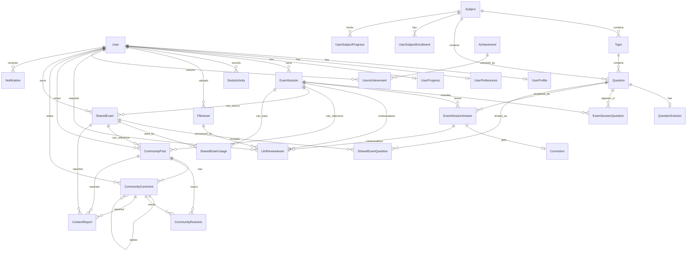

# ExamInA - Entidades y conexiones actuales

Fuente de verdad: `apps/api/prisma/schema.prisma`.

Ultima actualizacion: 2026-06-02.

Este documento describe el modelo actual real. Ya no existen `Attempt`, `AttemptAsset`, `ExamSessionAsset`, `QuestionKeyword`, `UserTopicProgress` ni `LevelRule` en el schema actual.

## Resumen actual

- `User` es el usuario interno sincronizado con Firebase.
- `ExamSession` es el eje del producto de examenes.
- `ExamSessionQuestion` guarda las preguntas que componen una sesion.
- `ExamSessionAnswer` guarda la unica respuesta de una pregunta dentro de una sesion.
- `Correction` cuelga directamente de `ExamSessionAnswer`.
- `QuestionSolution.expectedKeywords` guarda las palabras clave esperadas; no existe tabla separada de keywords.
- `FileAsset` es la tabla central de archivos y tambien guarda su contexto de uso mediante `ownerType`, `ownerId`, `role` y `status`.
- `LlmReviewAsset` se mantiene separada porque representa un proceso de OCR/IA sobre un archivo.

## Diagrama general

## Flujo real de examen

1. Se crea una `ExamSession` para un `User`.
2. Se crean filas en `ExamSessionQuestion` con el orden de preguntas y snapshots.
3. Mientras el usuario estudia, el heartbeat actualiza `ExamSession.totalTimeSeconds`, `lastActivityAt`, `StudyActivity.studyTimeSeconds` y `UserProgress.totalStudyTimeSeconds`.
4. Cuando el usuario envia una respuesta, la API valida que la pregunta pertenezca a esa `ExamSession`.
5. Si ya existe `ExamSessionAnswer` para `(examSessionId, questionId)`, la API debe devolver `409 Conflict`.
6. Si no existe, se crea `ExamSessionAnswer`.
7. La IA devuelve el resultado y se crea `Correction` conectada a esa `ExamSessionAnswer`.
8. Los logros y progreso se evaluan desde `ExamSessionAnswer`, `ExamSession`, `StudyActivity` y `UserProgress`.

## Tablas actuales

### User

Tabla fisica: `users`.

Proposito: usuario interno de ExamInA sincronizado con Firebase. Es la raiz de auth, perfiles, sesiones, comunidad, archivos, logros y notificaciones.

Campos:

| Campo | Tipo | Para que sirve |
| --- | --- | --- |
| `id` | `String` | ID interno del usuario. |
| `firebaseUid` | `String` | UID de Firebase; unico. |
| `email` | `String` | Correo del usuario; unico. |
| `displayName` | `String?` | Nombre visible recibido desde auth o perfil. |
| `photoUrl` | `String?` | Foto recibida desde proveedor auth; puede convivir con `FileAsset` de perfil. |
| `role` | `UserRole` | Rol del usuario: estudiante, moderador o admin. |
| `status` | `UserStatus` | Estado de la cuenta. |
| `createdAt` | `DateTime` | Fecha de creacion. |
| `updatedAt` | `DateTime` | Fecha de ultima actualizacion. |

Relaciones principales: `profile`, `preferences`, `progress`, `examSessions`, `fileAssets`, `achievements`, comunidad, reportes y notificaciones.

### UserProfile

Tabla fisica: `user_profiles`.

Proposito: informacion publica/comunitaria del usuario y datos de perfil usados en onboarding.

Campos:

| Campo | Tipo | Para que sirve |
| --- | --- | --- |
| `id` | `String` | ID del perfil. |
| `userId` | `String` | Usuario propietario; unico. |
| `username` | `String` | Nombre publico unico. |
| `bio` | `String?` | Descripcion corta del usuario. |
| `targetUniversity` | `String?` | Universidad objetivo. |
| `avatarFileId` | `String?` | Referencia al archivo de avatar. Debe apuntar a un `FileAsset` activo. |
| `bannerFileId` | `String?` | Referencia al banner de perfil. |
| `level` | `Int` | Nivel visual del usuario. |
| `experience` | `Int` | Experiencia visible del perfil. |
| `currentStreakDays` | `Int` | Racha actual calculada/guardada. |
| `longestStreakDays` | `Int` | Mejor racha historica. |
| `lastStudyDate` | `DateTime?` | Ultima fecha de estudio usada para racha. |
| `createdAt` | `DateTime` | Fecha de creacion. |
| `updatedAt` | `DateTime` | Fecha de ultima actualizacion. |

Nota: `level` y `experience` pueden duplicar informacion de `UserProgress`; revisar cuando cerremos sistema de niveles.

### UserPreferences

Tabla fisica: `user_preferences`.

Proposito: preferencias privadas, configuracion de estudio y estado de onboarding.

Campos:

| Campo | Tipo | Para que sirve |
| --- | --- | --- |
| `id` | `String` | ID de preferencias. |
| `userId` | `String` | Usuario propietario; unico. |
| `preferredTheme` | `String` | Tema preferido: por ejemplo `system`, `light`, `dark`. |
| `preferredLanguage` | `String` | Idioma preferido. |
| `notificationsEnabled` | `Boolean` | Activa/desactiva notificaciones. |
| `studyReminderEnabled` | `Boolean` | Activa recordatorio de estudio. |
| `studyReminderTime` | `String?` | Hora de recordatorio. |
| `timerSoundEnabled` | `Boolean` | Sonido del timer. |
| `defaultExamDurationSeconds` | `Int` | Duracion por defecto de examen. |
| `preferredSubjects` | `Json?` | Materias preferidas del onboarding. |
| `weeklyStudyHours` | `String?` | Horas semanales objetivo. |
| `referralSource` | `String?` | Fuente de referencia. |
| `onboardingCompleted` | `Boolean` | Marca si termino onboarding. |
| `createdAt` | `DateTime` | Fecha de creacion. |
| `updatedAt` | `DateTime` | Fecha de ultima actualizacion. |

### Subject

Tabla fisica: `subjects`.

Proposito: materias de estudio como Matematicas, Biologia, Fisica, etc.

Campos:

| Campo | Tipo | Para que sirve |
| --- | --- | --- |
| `id` | `String` | ID de materia. |
| `name` | `String` | Nombre visible. |
| `slug` | `String` | Identificador legible unico. |
| `description` | `String?` | Descripcion de la materia. |
| `createdAt` | `DateTime` | Fecha de creacion. |

Relaciones: `topics`, `questions`, `enrollments`, `progress`.

### Topic

Tabla fisica: `topics`.

Proposito: temas dentro de una materia. Sirve para temario y agrupacion de preguntas.

Campos:

| Campo | Tipo | Para que sirve |
| --- | --- | --- |
| `id` | `String` | ID de tema. |
| `subjectId` | `String` | Materia a la que pertenece. |
| `name` | `String` | Nombre visible del tema. |
| `slug` | `String` | Identificador dentro de la materia. |
| `createdAt` | `DateTime` | Fecha de creacion. |

Restricciones: `subjectId + slug` es unico.

### Question

Tabla fisica: `questions`.

Proposito: banco central de preguntas. Una pregunta pertenece a una materia y a un tema.

Campos:

| Campo | Tipo | Para que sirve |
| --- | --- | --- |
| `id` | `String` | ID de pregunta. |
| `subjectId` | `String` | Materia de la pregunta. |
| `topicId` | `String` | Tema de la pregunta. |
| `statement` | `String` | Enunciado. Puede contener LaTeX. |
| `type` | `QuestionType` | Tipo de pregunta. |
| `difficulty` | `QuestionDifficulty` | Dificultad. |
| `sourceYear` | `Int?` | Ano de fuente si aplica. |
| `sourceExam` | `String?` | Nombre/fuente del examen si aplica. |
| `createdAt` | `DateTime` | Fecha de creacion. |
| `updatedAt` | `DateTime` | Fecha de ultima actualizacion. |

Relaciones: `solution`, `examSessionQuestions`, `examSessionAnswers`, `sharedExamQuestions`.

### QuestionSolution

Tabla fisica: `question_solutions`.

Proposito: solucion esperada de una pregunta. Aqui viven tambien las palabras clave esperadas.

Campos:

| Campo | Tipo | Para que sirve |
| --- | --- | --- |
| `id` | `String` | ID de solucion. |
| `questionId` | `String` | Pregunta asociada; unico. |
| `finalAnswer` | `String` | Respuesta final corta. |
| `explanation` | `String` | Procedimiento/explicacion esperada. |
| `gradingCriteria` | `Json?` | Criterios de calificacion estructurados si se necesitan. |
| `expectedKeywords` | `String[]` | Palabras o conceptos clave esperados para la evaluacion IA. |
| `createdAt` | `DateTime` | Fecha de creacion. |
| `updatedAt` | `DateTime` | Fecha de ultima actualizacion. |

Nota: no existe `QuestionKeyword`; las keywords pertenecen a esta tabla.

### Correction

Tabla fisica: `corrections`.

Proposito: resultado de la evaluacion IA de una respuesta concreta de examen.

Campos:

| Campo | Tipo | Para que sirve |
| --- | --- | --- |
| `id` | `String` | ID de correccion. |
| `examSessionAnswerId` | `String` | Respuesta corregida; unico. |
| `isCorrect` | `Boolean` | Marca si la respuesta se considera correcta. |
| `score` | `Float` | Nota calculada por IA. |
| `summary` | `String` | Resumen corto del resultado. |
| `feedback` | `String` | Retroalimentacion detallada. |
| `detectedErrors` | `Json?` | Errores detectados. |
| `missingKeywords` | `Json?` | Conceptos esperados que faltaron. |
| `suggestions` | `Json?` | Sugerencias de mejora. |
| `recommendedTopics` | `Json?` | Temas recomendados para reforzar. |
| `createdAt` | `DateTime` | Fecha de creacion. |

Relacion: `Correction` cuelga de `ExamSessionAnswer`, no de `Attempt`.

### ExamSession

Tabla fisica: `exam_sessions`.

Proposito: sesion/examen concreto de un usuario. Es la unidad recuperable del historial.

Campos:

| Campo | Tipo | Para que sirve |
| --- | --- | --- |
| `id` | `String` | ID de sesion. |
| `userId` | `String` | Usuario propietario. |
| `title` | `String` | Titulo visible del examen/sesion. |
| `mode` | `ExamSessionMode` | Modo: practica, simulacro, flashcards o custom. |
| `status` | `ExamSessionStatus` | Estado: draft, en progreso, completada o abandonada. |
| `durationLimitSeconds` | `Int?` | Duracion limite. |
| `startedAt` | `DateTime?` | Fecha de inicio. |
| `finishedAt` | `DateTime?` | Fecha de finalizacion. |
| `lastActivityAt` | `DateTime?` | Ultima actividad registrada. |
| `resumeExpiresAt` | `DateTime?` | Fecha limite para reanudar si se usa expiracion. |
| `totalTimeSeconds` | `Int` | Tiempo total registrado por heartbeat/sync. Siempre se mide; mostrar u ocultar el reloj es decision de UI. |
| `totalScore` | `Float?` | Nota total si se calcula. |
| `maxScore` | `Float?` | Puntaje maximo posible si se calcula. |
| `createdAt` | `DateTime` | Fecha de creacion. |
| `updatedAt` | `DateTime` | Fecha de ultima actualizacion. |

Relaciones: `questions`, `answers`, `llmReviews`, comunidad y shared exams.

### ExamSessionQuestion

Tabla fisica: `exam_session_questions`.

Proposito: lista ordenada de preguntas que componen una sesion.

Campos:

| Campo | Tipo | Para que sirve |
| --- | --- | --- |
| `id` | `String` | ID de fila. |
| `examSessionId` | `String` | Sesion a la que pertenece. |
| `questionId` | `String` | Pregunta incluida. |
| `sortOrder` | `Int` | Orden dentro de la sesion; mapeado a columna `order`. |
| `questionSnapshot` | `Json` | Snapshot del enunciado/datos al crear la sesion. |
| `solutionSnapshot` | `Json?` | Snapshot de solucion si aplica. |
| `createdAt` | `DateTime` | Fecha de creacion. |

Restricciones: `examSessionId + sortOrder` y `examSessionId + questionId` son unicos.

### ExamSessionAnswer

Tabla fisica: `exam_session_answers`.

Proposito: respuesta de una pregunta dentro de una sesion. Es la fuente unica de respuestas del usuario.

Campos:

| Campo | Tipo | Para que sirve |
| --- | --- | --- |
| `id` | `String` | ID de respuesta. |
| `examSessionId` | `String` | Sesion a la que pertenece. |
| `questionId` | `String` | Pregunta respondida. |
| `userAnswer` | `String` | Respuesta escrita/procesada. |
| `score` | `Float?` | Nota de la respuesta. |
| `isCorrect` | `Boolean?` | Resultado booleano. |
| `answeredAt` | `DateTime?` | Momento de respuesta. |
| `createdAt` | `DateTime` | Fecha de creacion. |

Restriccion: `examSessionId + questionId` es unico. Esto fuerza una sola evaluacion por pregunta en una sesion.

### UserProgress

Tabla fisica: `user_progress`.

Proposito: progreso global acumulado del usuario.

Campos:

| Campo | Tipo | Para que sirve |
| --- | --- | --- |
| `id` | `String` | ID de progreso. |
| `userId` | `String` | Usuario propietario; unico. |
| `totalQuestionsAnswered` | `Int` | Total de preguntas respondidas. |
| `totalCorrectAnswers` | `Int` | Total de respuestas correctas. |
| `totalExamsCompleted` | `Int` | Total de examenes completados. |
| `totalFlashcardsReviewed` | `Int` | Total de flashcards revisadas. |
| `totalStudyTimeSeconds` | `Int` | Tiempo total de estudio. |
| `averageScore` | `Float` | Nota promedio global. |
| `level` | `Int` | Nivel global. |
| `experience` | `Int` | Experiencia global. |
| `createdAt` | `DateTime` | Fecha de creacion. |
| `updatedAt` | `DateTime` | Fecha de ultima actualizacion. |

### UserSubjectEnrollment

Tabla fisica: `user_subject_enrollments`.

Proposito: materias que un usuario sigue/estudia.

Campos:

| Campo | Tipo | Para que sirve |
| --- | --- | --- |
| `id` | `String` | ID de inscripcion. |
| `userId` | `String` | Usuario. |
| `subjectId` | `String` | Materia. |
| `status` | `UserSubjectEnrollmentStatus` | Estado de la materia para el usuario. |
| `startedAt` | `DateTime` | Fecha de inicio. |
| `endedAt` | `DateTime?` | Fecha de fin si aplica. |
| `createdAt` | `DateTime` | Fecha de creacion. |
| `updatedAt` | `DateTime` | Fecha de ultima actualizacion. |

Restriccion: `userId + subjectId` es unico.

### UserSubjectProgress

Tabla fisica: `user_subject_progress`.

Proposito: progreso agregado del usuario por materia.

Campos:

| Campo | Tipo | Para que sirve |
| --- | --- | --- |
| `id` | `String` | ID de progreso por materia. |
| `userId` | `String` | Usuario. |
| `subjectId` | `String` | Materia. |
| `questionsAnswered` | `Int` | Preguntas respondidas en la materia. |
| `correctAnswers` | `Int` | Respuestas correctas en la materia. |
| `examsCompleted` | `Int` | Examenes completados en la materia. |
| `averageScore` | `Float` | Nota promedio por materia. |
| `studyTimeSeconds` | `Int` | Tiempo estudiado por materia. |
| `masteryLevel` | `Int` | Dominio estimado. |
| `createdAt` | `DateTime` | Fecha de creacion. |
| `updatedAt` | `DateTime` | Fecha de ultima actualizacion. |

Estado: existe y se actualiza parcialmente, pero falta una pantalla clara que lo explote.

### StudyActivity

Tabla fisica: `study_activities`.

Proposito: actividad diaria para dashboard, rachas y tiempo de estudio.

Campos:

| Campo | Tipo | Para que sirve |
| --- | --- | --- |
| `id` | `String` | ID de actividad. |
| `userId` | `String` | Usuario. |
| `activityDate` | `DateTime` | Dia de actividad. |
| `questionsAnswered` | `Int` | Preguntas respondidas ese dia. |
| `correctAnswers` | `Int` | Correctas ese dia. |
| `flashcardsReviewed` | `Int` | Flashcards revisadas ese dia. |
| `examsCompleted` | `Int` | Examenes completados ese dia. |
| `studyTimeSeconds` | `Int` | Tiempo estudiado ese dia. |
| `experienceEarned` | `Int` | Experiencia ganada ese dia. |
| `createdAt` | `DateTime` | Fecha de creacion. |
| `updatedAt` | `DateTime` | Fecha de ultima actualizacion. |

Restriccion: `userId + activityDate` es unico.

### Achievement

Tabla fisica: `achievements`.

Proposito: catalogo de logros desbloqueables.

Campos:

| Campo | Tipo | Para que sirve |
| --- | --- | --- |
| `id` | `String` | ID del logro. |
| `code` | `String` | Codigo unico usado por backend/frontend. |
| `title` | `String` | Titulo visible. |
| `description` | `String` | Descripcion del logro. |
| `icon` | `String?` | Codigo/nombre del icono o medalla. |
| `experienceReward` | `Int` | XP que entrega. |
| `createdAt` | `DateTime` | Fecha de creacion. |

### UserAchievement

Tabla fisica: `user_achievements`.

Proposito: logros desbloqueados por usuario.

Campos:

| Campo | Tipo | Para que sirve |
| --- | --- | --- |
| `id` | `String` | ID de desbloqueo. |
| `userId` | `String` | Usuario. |
| `achievementId` | `String` | Logro desbloqueado. |
| `unlockedAt` | `DateTime` | Fecha de desbloqueo. |

Restriccion: `userId + achievementId` es unico.

### FileAsset

Tabla fisica: `file_assets`.

Proposito: metadata central de archivos en local/S3 y contexto de uso actual.

Campos:

| Campo | Tipo | Para que sirve |
| --- | --- | --- |
| `id` | `String` | ID del asset. |
| `userId` | `String` | Usuario que subio el archivo. |
| `bucket` | `String` | Bucket/storage usado. |
| `key` | `String` | Key/ruta interna del archivo. |
| `url` | `String?` | URL publica o firmada si aplica. |
| `mimeType` | `String` | Tipo MIME. |
| `sizeBytes` | `Int` | Tamano en bytes. |
| `originalFilename` | `String` | Nombre original. |
| `fileType` | `FileAssetType` | Imagen, PDF, audio, video u otro. |
| `visibility` | `FileAssetVisibility` | Privado o publico. |
| `purpose` | `FileAssetPurpose` | Proposito general del archivo. |
| `ownerType` | `AssetOwnerType?` | Tipo de entidad donde se usa. |
| `ownerId` | `String?` | ID de la entidad donde se usa. |
| `role` | `AssetRole` | Rol especifico: avatar, imagen de pregunta, tablero, etc. |
| `status` | `FileAssetStatus` | Activo, reemplazado, eliminado, etc. |
| `sortOrder` | `Int` | Orden si hay varios assets del mismo contexto. |
| `checksum` | `String?` | Hash/checksum opcional. |
| `width` | `Int?` | Ancho si es imagen/video. |
| `height` | `Int?` | Alto si es imagen/video. |
| `deactivatedAt` | `DateTime?` | Fecha de desactivacion. |
| `createdAt` | `DateTime` | Fecha de creacion. |
| `updatedAt` | `DateTime` | Fecha de ultima actualizacion. |

Nota: no existe `AssetLink`; el contexto vive en `FileAsset`.

### LlmReviewAsset

Tabla fisica: `llm_review_assets`.

Proposito: proceso de OCR/vision/IA sobre un archivo.

Campos:

| Campo | Tipo | Para que sirve |
| --- | --- | --- |
| `id` | `String` | ID del proceso. |
| `fileAssetId` | `String` | Archivo procesado. |
| `userId` | `String` | Usuario que solicita/provoca el proceso. |
| `examSessionId` | `String?` | Sesion relacionada si aplica. |
| `examSessionAnswerId` | `String?` | Respuesta relacionada si aplica. |
| `status` | `LlmReviewStatus` | Estado del procesamiento. |
| `extractedText` | `String?` | Texto extraido por OCR. |
| `llmInputSnapshot` | `Json?` | Entrada enviada al LLM. |
| `llmOutputSnapshot` | `Json?` | Salida recibida del LLM. |
| `errorMessage` | `String?` | Error si falla. |
| `createdAt` | `DateTime` | Fecha de creacion. |
| `processedAt` | `DateTime?` | Fecha de procesamiento. |

### Friendship

Tabla fisica: `friendships`.

Proposito: conexion entre dos usuarios.

Campos:

| Campo | Tipo | Para que sirve |
| --- | --- | --- |
| `id` | `String` | ID de amistad. |
| `requesterId` | `String` | Usuario que envia la solicitud. |
| `receiverId` | `String` | Usuario que recibe la solicitud. |
| `status` | `FriendshipStatus` | Estado de la relacion. |
| `createdAt` | `DateTime` | Fecha de creacion. |
| `updatedAt` | `DateTime` | Fecha de ultima actualizacion. |

Restriccion: `requesterId + receiverId` es unico.

### UserModerationAction

Tabla fisica: `user_moderation_actions`.

Proposito: acciones de moderacion aplicadas a usuarios.

Campos:

| Campo | Tipo | Para que sirve |
| --- | --- | --- |
| `id` | `String` | ID de accion. |
| `userId` | `String` | Usuario moderado. |
| `moderatorId` | `String?` | Moderador que aplica la accion. |
| `action` | `ModerationActionType` | Tipo de accion. |
| `reason` | `ModerationReason` | Motivo. |
| `notes` | `String?` | Notas internas. |
| `startsAt` | `DateTime?` | Inicio de accion si aplica. |
| `endsAt` | `DateTime?` | Fin de accion si aplica. |
| `createdAt` | `DateTime` | Fecha de creacion. |

Estado: existe en schema, pero aun no es un flujo central del MVP.

### CommunityPost

Tabla fisica: `community_posts`.

Proposito: publicaciones del feed/comunidad.

Campos:

| Campo | Tipo | Para que sirve |
| --- | --- | --- |
| `id` | `String` | ID del post. |
| `authorId` | `String` | Autor. |
| `type` | `CommunityPostType` | Tipo de publicacion. |
| `visibility` | `CommunityVisibility` | Publico, amigos o privado. |
| `title` | `String?` | Titulo opcional. |
| `content` | `String` | Contenido. |
| `examSessionId` | `String?` | Sesion relacionada si aplica. |
| `sharedExamId` | `String?` | Examen compartido relacionado si aplica. |
| `status` | `CommunityContentStatus` | Estado de contenido. |
| `createdAt` | `DateTime` | Fecha de creacion. |
| `updatedAt` | `DateTime` | Fecha de ultima actualizacion. |

### CommunityComment

Tabla fisica: `community_comments`.

Proposito: comentarios y respuestas en posts.

Campos:

| Campo | Tipo | Para que sirve |
| --- | --- | --- |
| `id` | `String` | ID del comentario. |
| `postId` | `String` | Post al que pertenece. |
| `authorId` | `String` | Autor. |
| `parentCommentId` | `String?` | Comentario padre si es respuesta. |
| `content` | `String` | Contenido. |
| `status` | `CommunityContentStatus` | Estado del comentario. |
| `createdAt` | `DateTime` | Fecha de creacion. |
| `updatedAt` | `DateTime` | Fecha de ultima actualizacion. |

### CommunityReaction

Tabla fisica: `community_reactions`.

Proposito: reacciones a posts o comentarios.

Campos:

| Campo | Tipo | Para que sirve |
| --- | --- | --- |
| `id` | `String` | ID de reaccion. |
| `userId` | `String` | Usuario que reacciona. |
| `postId` | `String?` | Post reaccionado. |
| `commentId` | `String?` | Comentario reaccionado. |
| `type` | `CommunityReactionType` | Tipo de reaccion. |
| `createdAt` | `DateTime` | Fecha de creacion. |

Restricciones: una reaccion por usuario, target y tipo.

### SharedExam

Tabla fisica: `shared_exams`.

Proposito: examen compartido por usuario o equipo oficial. Puede venir de una `ExamSession`.

Campos:

| Campo | Tipo | Para que sirve |
| --- | --- | --- |
| `id` | `String` | ID del examen compartido. |
| `ownerId` | `String` | Creador/propietario. |
| `sourceExamSessionId` | `String?` | Sesion origen si se compartio desde una sesion. |
| `title` | `String` | Titulo. |
| `description` | `String?` | Descripcion. |
| `visibility` | `CommunityVisibility` | Visibilidad. |
| `status` | `SharedExamStatus` | Estado de publicacion. |
| `allowCloning` | `Boolean` | Permite clonar/reusar. |
| `createdAt` | `DateTime` | Fecha de creacion. |
| `updatedAt` | `DateTime` | Fecha de ultima actualizacion. |

### SharedExamUsage

Tabla fisica: `shared_exam_usages`.

Proposito: seguimiento de uso de un examen compartido por un usuario.

Campos:

| Campo | Tipo | Para que sirve |
| --- | --- | --- |
| `id` | `String` | ID de uso. |
| `sharedExamId` | `String` | Examen compartido usado. |
| `userId` | `String` | Usuario que lo usa. |
| `examSessionId` | `String?` | Sesion creada/relacionada. |
| `status` | `SharedExamUsageStatus` | Estado de uso. |
| `startedAt` | `DateTime?` | Inicio. |
| `finishedAt` | `DateTime?` | Finalizacion. |
| `createdAt` | `DateTime` | Fecha de creacion. |

### SharedExamQuestion

Tabla fisica: `shared_exam_questions`.

Proposito: preguntas ordenadas que componen un examen compartido.

Campos:

| Campo | Tipo | Para que sirve |
| --- | --- | --- |
| `id` | `String` | ID de fila. |
| `sharedExamId` | `String` | Examen compartido. |
| `questionId` | `String` | Pregunta incluida. |
| `sortOrder` | `Int` | Orden dentro del examen; mapeado a `order`. |
| `questionSnapshot` | `Json` | Snapshot de la pregunta al compartir. |
| `solutionSnapshot` | `Json?` | Snapshot de solucion si aplica. |
| `createdAt` | `DateTime` | Fecha de creacion. |

Restricciones: `sharedExamId + sortOrder` y `sharedExamId + questionId` son unicos.

### ContentReport

Tabla fisica: `content_reports`.

Proposito: reportes de contenido o usuarios.

Campos:

| Campo | Tipo | Para que sirve |
| --- | --- | --- |
| `id` | `String` | ID de reporte. |
| `reporterId` | `String` | Usuario que reporta. |
| `targetType` | `ReportTargetType` | Tipo de target reportado. |
| `postId` | `String?` | Post reportado si aplica. |
| `commentId` | `String?` | Comentario reportado si aplica. |
| `sharedExamId` | `String?` | Examen compartido reportado si aplica. |
| `reportedUserId` | `String?` | Usuario reportado si aplica. |
| `reason` | `ModerationReason` | Motivo del reporte. |
| `details` | `String?` | Detalles adicionales. |
| `status` | `ReportStatus` | Estado del reporte. |
| `createdAt` | `DateTime` | Fecha de creacion. |
| `resolvedAt` | `DateTime?` | Fecha de resolucion. |

### Notification

Tabla fisica: `notifications`.

Proposito: notificaciones internas para el usuario.

Campos:

| Campo | Tipo | Para que sirve |
| --- | --- | --- |
| `id` | `String` | ID de notificacion. |
| `userId` | `String` | Usuario receptor. |
| `type` | `NotificationType` | Tipo de notificacion. |
| `title` | `String` | Titulo. |
| `content` | `String` | Contenido/mensaje. |
| `read` | `Boolean` | Marca de lectura. |
| `metadata` | `Json?` | Datos extra para deep links o contexto. |
| `createdAt` | `DateTime` | Fecha de creacion. |
| `updatedAt` | `DateTime` | Fecha de ultima actualizacion. |

## Enums principales

### Auth y usuarios

- `UserRole`: `STUDENT`, `MODERATOR`, `ADMIN`.
- `UserStatus`: `ACTIVE`, `DISABLED`, `SUSPENDED`, `BANNED`, `DELETED`.

### Preguntas y examenes

- `QuestionType`: `OPEN_ANSWER`, `MULTIPLE_CHOICE`, `PROCEDURE`, `FLASHCARD`.
- `QuestionDifficulty`: `EASY`, `MEDIUM`, `HARD`.
- `ExamSessionMode`: `PRACTICE`, `MOCK_EXAM`, `FLASHCARDS`, `CUSTOM`.
- `ExamSessionStatus`: `DRAFT`, `IN_PROGRESS`, `COMPLETED`, `ABANDONED`.

### Archivos

- `FileAssetType`: `IMAGE`, `PDF`, `AUDIO`, `VIDEO`, `OTHER`.
- `FileAssetVisibility`: `PRIVATE`, `PUBLIC`.
- `FileAssetPurpose`: `AVATAR`, `BANNER`, `ANSWER_ATTACHMENT`, `QUESTION_ATTACHMENT`, `OCR_SOURCE`, `OTHER`.
- `AssetOwnerType`: `USER_PROFILE`, `QUESTION`, `QUESTION_SOLUTION`, `EXAM_SESSION`, `EXAM_SESSION_ANSWER`, `COMMUNITY_POST`, `COMMUNITY_COMMENT`, `SHARED_EXAM`, `LLM_REVIEW`.
- `AssetRole`: `PROFILE_PHOTO`, `PROFILE_BANNER`, `QUESTION_IMAGE`, `QUESTION_SOLUTION_IMAGE`, `ANSWER_IMAGE`, `ANSWER_WHITEBOARD`, `ANSWER_AUDIO`, `POST_IMAGE`, `COMMENT_IMAGE`, `EXAM_COVER`, `LLM_INPUT`, `OTHER`.
- `FileAssetStatus`: `ACTIVE`, `INACTIVE`, `REPLACED`, `DELETED`.
- `LlmReviewStatus`: `PENDING`, `PROCESSING`, `COMPLETED`, `FAILED`.

### Comunidad y moderacion

- `CommunityPostType`: `TEXT`, `QUESTION`, `EXAM_RESULT`, `PROGRESS_UPDATE`, `TIP`, `DOUBT`.
- `CommunityVisibility`: `PUBLIC`, `FRIENDS_ONLY`, `PRIVATE`.
- `CommunityContentStatus`: `PUBLISHED`, `HIDDEN`, `DELETED`, `UNDER_REVIEW`.
- `CommunityReactionType`: `LIKE`, `USEFUL`, `CONGRATS`, `INTERESTING`, `SAVED`.
- `FriendshipStatus`: `PENDING`, `ACCEPTED`, `REJECTED`, `BLOCKED`.
- `ModerationActionType`: `WARNING`, `TEMPORARY_SUSPENSION`, `PERMANENT_BAN`, `ACCOUNT_RESTORED`, `CONTENT_RESTRICTION`.
- `ModerationReason`: `SPAM`, `HARASSMENT`, `HATE_SPEECH`, `EXPLICIT_CONTENT`, `IMPERSONATION`, `CHEATING`, `COPYRIGHT_VIOLATION`, `MALICIOUS_LINKS`, `INAPPROPRIATE_PROFILE`, `INAPPROPRIATE_CONTENT`, `REPEATED_RULE_VIOLATIONS`, `OTHER`.
- `ReportTargetType`: `POST`, `COMMENT`, `SHARED_EXAM`, `USER`.
- `ReportStatus`: `OPEN`, `UNDER_REVIEW`, `RESOLVED`, `DISMISSED`.

### Shared exams y notificaciones

- `SharedExamStatus`: `DRAFT`, `PUBLISHED`, `UNLISTED`, `ARCHIVED`, `HIDDEN`.
- `SharedExamUsageStatus`: `STARTED`, `FINISHED`, `ABANDONED`.
- `NotificationType`: `ACHIEVEMENT_UNLOCK`, `EXAM_CREATED`, `EXAM_FINISHED`, `FRIEND_REQUEST`, `POST_COMMENTED`, `POST_LIKED`.

## Tablas eliminadas del modelo actual

Estas tablas ya no existen en el schema actual:

- `Attempt`
- `AttemptAsset`
- `ExamSessionAsset`
- `QuestionKeyword`
- `UserTopicProgress`
- `LevelRule`

Si alguna migracion historica las menciona, es solo historial de migraciones antiguas. El schema actual ya no las define.
