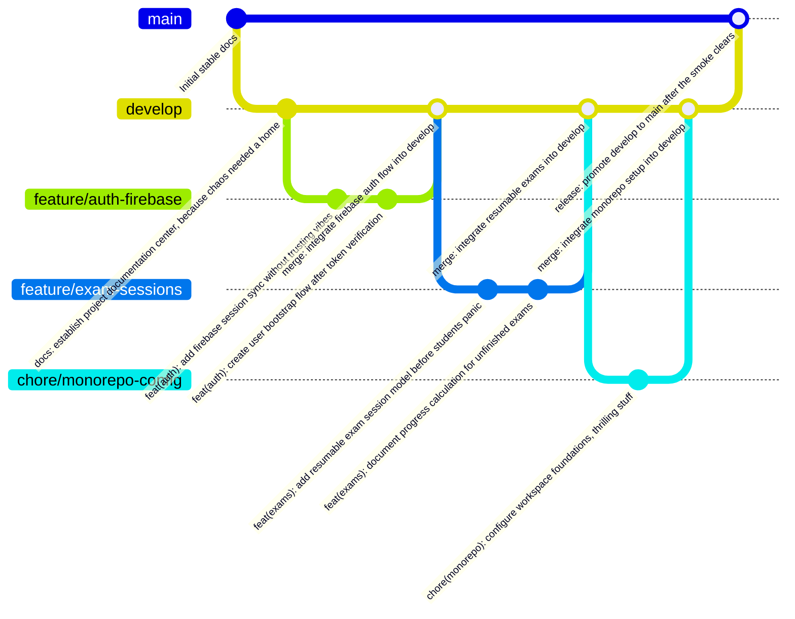

# ExamInA - Workflow de Git

Este documento define cómo trabajaremos con Git en ExamInA.

La idea es mantener un historial limpio, ramas con propósito claro y cambios revisables.

Regla importante: los commits deben escribirse siempre en inglés.

El tono puede tener un toque de sarcasmo ligero, pero sin perder claridad profesional. El sarcasmo no debe reemplazar la explicación del cambio.

## Objetivo

Queremos que cada cambio sea fácil de entender:

- qué se cambió;
- por qué se cambió;
- qué parte del sistema afecta;
- cómo se puede probar;
- si deja trabajo pendiente.

## Ramas principales

### `main`

Rama principal estable.

Debe contener código funcional y revisado.

No se debe trabajar directamente sobre `main`.

`main` recibe cambios desde `develop` cuando una versión está lista para considerarse estable.

### `develop`

Rama de integración.

Aquí se juntan features antes de pasar a `main`.

Todas las ramas de trabajo salen desde `develop` y vuelven a `develop` mediante merge o PR.

Cuando `develop` está estable, se integra en `main`.

## Flujo principal

El flujo base será Gitflow simplificado:

1. `main` es la rama principal estable.
2. `develop` sale desde `main`.
3. Las ramas de trabajo salen desde `develop`.
4. Los commits se hacen en la rama de trabajo.
5. La rama de trabajo se mergea a `develop`.
6. Cuando `develop` está listo, se mergea a `main`.

## Diagrama Gitflow de ejemplo



## Ramas de trabajo

Formato recomendado:

```txt
tipo/descripcion-corta
```

Ejemplos:

```txt
feature/auth-firebase
feature/exam-sessions
feature/ai-corrections
feature/shared-exams
fix/exam-progress-calculation
docs-update/entity-diagram
chore/monorepo-config
refactor/api-modules
```

## Tipos de rama

### `feature/`

Para funcionalidades nuevas.

Ejemplos:

- login con Firebase;
- banco de preguntas;
- corrección con IA;
- exámenes compartidos.

### `fix/`

Para corregir errores.

Ejemplos:

- cálculo incorrecto de progreso;
- fallo al recuperar examen;
- validación incorrecta de Zod.

### `docs-update/`

Para documentación.

Ejemplos:

- actualizar entidades;
- definir endpoints;
- explicar arquitectura.

### `chore/`

Para tareas de mantenimiento.

Ejemplos:

- configurar pnpm;
- actualizar scripts;
- ajustar eslint/prettier.

### `refactor/`

Para reorganizar código sin cambiar comportamiento.

Ejemplos:

- mover providers;
- separar use cases;
- limpiar mappers.

## Commits

Usaremos mensajes tipo Conventional Commits.

Regla obligatoria:

Antes de crear cualquier commit, el agente debe mostrar al usuario lo que se va a commitear y esperar confirmación explícita.

Como mínimo debe mostrar:

- rama actual;
- archivos modificados;
- resumen del cambio;
- mensaje de commit propuesto;
- si se hará push después del commit.

No se debe hacer commit ni push sin esa confirmación.

Antes de cerrar un commit, revisar si el cambio requiere actualizar:

```txt
docs/AGENT_HANDOFF.md
```

Si el commit cambia contexto importante del proyecto, el handoff debe actualizarse en el mismo commit.

Formato:

```txt
tipo(scope): descripción corta
```

Los commits deben ser:

- en inglés siempre;
- suficientemente explicativos;
- concretos sobre qué cambió;
- claros sobre el área afectada;
- ligeramente sarcásticos si apetece, pero nunca ambiguos.

Ejemplos:

```txt
docs(project): add initial architecture plan so future us stops guessing
docs(api): define endpoint map before controllers start improvising
feat(auth): add firebase auth provider without leaking provider details
feat(exams): add resumable exam sessions before half-finished exams vanish
fix(progress): correct exam progress percentage because math had one job
chore(monorepo): configure pnpm workspace, glamorous but necessary
refactor(api): split questions module layers before it becomes soup
```

## Tipos de commit

- `feat`: nueva funcionalidad.
- `fix`: corrección de bug.
- `docs`: documentación.
- `chore`: mantenimiento/configuración.
- `refactor`: cambio interno sin modificar comportamiento.
- `test`: tests.
- `style`: formato, lint o estilos sin cambio lógico.
- `perf`: mejora de rendimiento.

## Tamaño de commits

Los commits deben ser pequeños y coherentes.

Un commit debería representar una idea completa.

Evitar mezclar en el mismo commit:

- cambios de backend y frontend sin relación directa;
- refactors grandes con features;
- formateo masivo con cambios de lógica;
- documentación y cambios funcionales, salvo que sean parte clara del mismo cambio.

## Pull Requests

Cada PR debe explicar:

- qué cambia;
- por qué cambia;
- cómo se probó;
- riesgos o pendientes;
- screenshots si toca frontend.

Plantilla sugerida:

```md
## Qué cambia

## Por qué

## Cómo se probó

## Riesgos / pendientes
```

## Reglas antes de abrir PR

Antes de abrir un PR, intentar validar:

- `pnpm lint`
- `pnpm test`
- `pnpm build`

Cuando el monorepo todavía esté naciendo, puede que esos comandos no existan. En ese caso, el PR debe indicar qué sí se pudo verificar.

## Estrategia de merge

Preferencia inicial:

```txt
Squash and merge
```

Esto mantiene `main` limpio y hace que cada PR sea una unidad clara en el historial.

Cuando haya releases o un equipo más grande, se puede revisar si conviene merge commit o rebase.

## Versionado

Al inicio no hace falta versionado complejo.

Más adelante se puede usar:

- tags para releases;
- changelog;
- semantic versioning si hay paquetes publicados.

## Trabajo con documentación

Los documentos de planificacion de la raiz son parte del proyecto.

Si una decisión técnica cambia, se debe actualizar la documentación en el mismo PR o en un PR de documentación inmediatamente después.

Ejemplos:

- si cambia una entidad, actualizar `EXAMINA_ENTITY_DIAGRAM.md`;
- si cambia una ruta, actualizar `EXAMINA_API_ENDPOINTS.md`;
- si cambia arquitectura, actualizar `EXAMINA_PROJECT_PLAN.md`.

## Regla práctica

Primero documentamos lo grande.

Después implementamos en bloques pequeños.

Luego validamos, ajustamos y volvemos a documentar si algo cambió.
